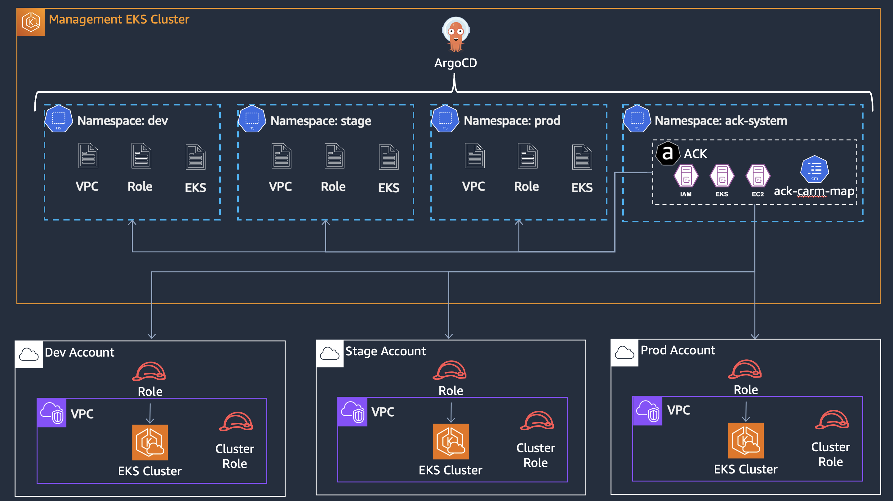
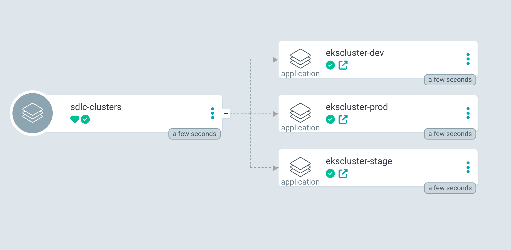
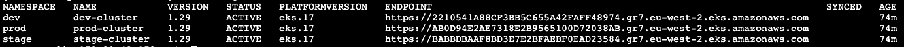
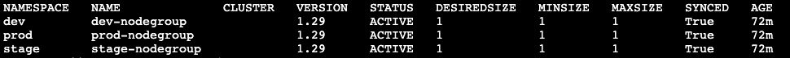

# Building Cross-Account EKS Clusters with ACK, Helm, and ArgoCD

## Introduction

### Overview
In a modern cloud-native environment, managing Kubernetes clusters across multiple AWS accounts can be complex. The need for seamless integration, security, and governance becomes even more crucial when multiple teams work across environments such as development, staging, and production. This case study explores how to use [Helm](https://helm.sh/), [AWS Controllers for Kubernetes (ACK)](https://github.com/aws-controllers-k8s/community), and [ArgoCD](https://argo-cd.readthedocs.io/en/latest/) to create, configure, and manage cross-account Amazon EKS clusters from a centralized management EKS cluster in a Hub and Spoke architecture.

By leveraging Helm charts for provisioning and ACK for managing AWS resources, we streamline the creation of EKS clusters across development, staging, and production accounts. ArgoCD enables continuous delivery of applications and Kubernetes configurations, ensuring consistency and security.

## Solution Overview

### Centralized EKS Management with Cross-Account Automation

This case study presents a solution for managing Kubernetes clusters in a cross-account environment by setting up a Hub and Spoke architecture, where a management EKS cluster serves as the control plane for all other clusters across multiple AWS accounts (the spokes).

#### Key Components:

- **Hub (Management Cluster)**: A centralized EKS cluster in the management account that serves as the control plane. This cluster is responsible for provisioning, configuring, and managing the spoke clusters and runs essential tools such as:
    - **ACK (AWS Controllers for Kubernetes)**: Provides Kubernetes-native control over AWS services (including EKS clusters), allowing cross-account AWS resource management through Kubernetes manifests.
    - **Helm**: Used to define, deploy, and configure EKS clusters across AWS accounts using reusable charts.
    - **ArgoCD**: Implements GitOps for Continuous Delivery, ensuring Kubernetes manifests and configurations are automatically deployed across the cross-account EKS clusters.
  
- **Spokes (Cross-Account Clusters)**: EKS clusters in development, staging, and production accounts that are managed by the central management cluster. These clusters receive consistent deployments, configurations, and security policies pushed from the hub cluster.

### Benefits:
- **Centralized Control**: Streamlines the management of multiple Kubernetes clusters across various AWS accounts from a single management cluster.
- **Consistency & Security**: Ensures uniform deployment and security practices across environments.
- **Automation**: Leverages Helm, ACK, and ArgoCD for automated provisioning, management, and continuous delivery.
  
This architecture is designed to reduce operational complexity, improve governance, and automate the management of multiple EKS clusters in different AWS accounts.


## Solution Architecture 
 
 



**Hub Cluster (Management EKS Cluster)**: 
- The central management cluster (Control Plane) is deployed in a management AWS account and serves as the control plane, hosting all the tools required for provisioning and managing spoke EKS clusters.

**Spoke Clusters (Cross-Account EKS Clusters)**: 
- The spoke (Data Plane) are EKS clusters deployed in development, staging, and production accounts. These clusters are managed by the central management cluster and created using Helm charts.
- Each EKS cluster is isolated by account and environment but centrally governed by the management cluster, ensuring uniform configuration and policies across the SDLC pipeline.

**Helm for EKS Cluster Creation**: 
- Helm charts define the configuration for each EKS cluster, including details like VPC configuration, node groups, security groups, and IAM roles.
- By leveraging Helm, the process of creating EKS clusters across different AWS accounts is automated and repeatable. The same chart can be reused with different configurations (e.g., cluster size, node types) for development, staging, and production.

**ACK for AWS Resource Management**: 
- ACK is used to manage AWS resources like EKS, VPCs, and IAM roles directly from Kubernetes. This allows the management cluster to control the creation and management of EKS clusters in spoke accounts through Kubernetes manifests.
- The use of cross-account IAM roles enables the management cluster to securely interact with resources in other AWS accounts.

**ArgoCD for Continuous Delivery**: 
- ArgoCD is installed in the management cluster to monitor Git repositories for changes in cluster configurations or applications.
- Whenever changes are pushed to the repository (such as updating the Helm chart for the EKS cluster), ArgoCD automatically syncs those changes to the correct EKS cluster in the appropriate AWS account.

## Step-by-Step Implementation

### Step 1: Hub Cluster Setup (Management Cluster)
This cluster will run Helm, ACK, and ArgoCD to manage the spoke clusters.

- **Provision the Management [EKS Cluster](https://docs.aws.amazon.com/eks/latest/userguide/create-cluster.html)**.
- **Install relevant [ACK](https://aws-controllers-k8s.github.io/community/docs/user-docs/install/) in the Management Cluster**.
- **Install [ArgoCD](https://argo-cd.readthedocs.io/en/stable/operator-manual/installation/) in the Management Cluster**.

### Step 2: Configure ACK Service Controller
Configure the ACK service controller to manage resources in different AWS accounts. You will need to:

1. Configure the AWS accounts where the resources will be managed.
2. Map AWS accounts with the Role ARNs that need to be assumed.
3. Annotate namespaces with AWS Account IDs.

Please refer to the [Cross-Account Resource Management (CARM) documentation](https://docs.aws.amazon.com/eks/latest/userguide/cross-account.html) for detailed instructions.

### Step 3: Helm Charts for EKS Cluster Creation
Define a Helm chart that will create the EKS cluster using the required configurations. This chart should include settings for:

- VPC and Subnets
- Node Groups and Autoscaling
- NAT Gateway and IAM roles
- EKS Cluster

**Example [values-dev.yaml](charts/sdlc-clusters/values-dev.yaml) for an EKS development cluster Helm chart**:
```yaml
namespace: dev

region: "eu-west-2"
accountID: "22222222222"

vpc:
  cidrBlocks:
    - 192.168.0.0/16
  enableDNSSupport: true
  enableDNSHostnames: true

subnet1:
  availabilityZone: eu-west-2a
  cidrBlock: 192.168.0.0/18

subnet2:
  availabilityZone: eu-west-2b
  cidrBlock: 192.168.64.0/18

eksCluster:
  version: "1.29"
  endpointPrivateAccess: false
  endpointPublicAccess: true

nodegroup:
  diskSize: 100
  scalingConfig:
    minSize: 1
    maxSize: 1
    desiredSize: 1
```
### Step 4: Configure ArgoCD for Syncing Changes:
Set up ArgoCD to watch over Git repositories where the Helm charts for the EKS clusters are stored. For example, if an update is made to the Helm chart, ArgoCD will detect the change and automatically sync it to the appropriate EKS cluster in the target AWS account via the namespace.

**ArgoCD [app-of-apps manifest](https://argo-cd.readthedocs.io/en/latest/operator-manual/cluster-bootstrapping/) example**

```yaml
apiVersion: argoproj.io/v1alpha1
kind: Application
metadata:
  name: 'sdlc-clusters'
spec:
  destination:
    name: 'in-cluster'
    namespace: 'argocd'
  source:
    path: 'apps/'
    repoURL: 'git@github.com:xxxxxxxx.git'
    targetRevision: HEAD
  project: 'default'
  syncPolicy:
    automated:
      prune: true
```

**ArgoCD Applications**


**EKS Cluster Creation**



**NodeGroups Creation**



## Key Takeaways

- **Automated EKS Cluster Creation with Helm**:  
  By defining EKS clusters as Helm charts, you can automate the provisioning of clusters across AWS accounts, reducing manual errors and ensuring consistency.

- **Centralized Management via ACK**:  
  The management cluster centrally manages the lifecycle of EKS clusters across different AWS accounts, ensuring security and compliance across environments.

- **GitOps and Continuous Delivery**:  
  With ArgoCD, you can automate the deployment of EKS clusters and application updates, ensuring that all environments stay in sync with the desired state defined in Git.

- **Cross-Account Security**:  
  IAM roles and policies ensure secure, cross-account access to resources, minimizing the risk of unauthorized access.


## Conclusion

By adopting this Hub and Spoke architecture using Helm, AWS Controllers for Kubernetes (ACK), and ArgoCD, organizations can simplify and automate the creation and management of Amazon EKS clusters across multiple AWS accounts. 
Helm provides a standardized and repeatable method for provisioning clusters, while ACK enables centralized management of AWS resources. ArgoCD ensures continuous delivery and synchronization across all environments using a GitOps model. 
This approach reduces operational overhead, improves security, and scales easily, making it a robust solution for managing SDLC EKS clusters in complex, multi-account environments.

---